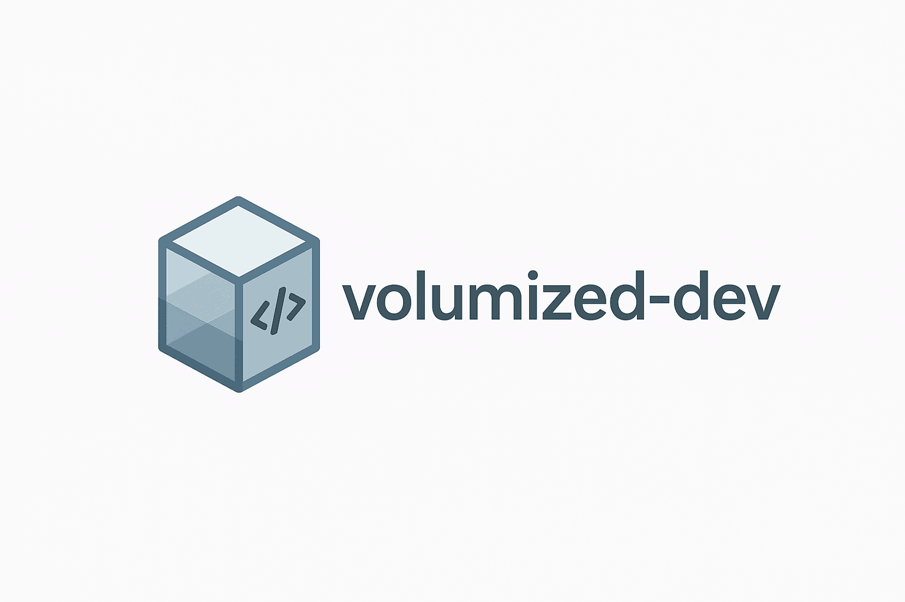
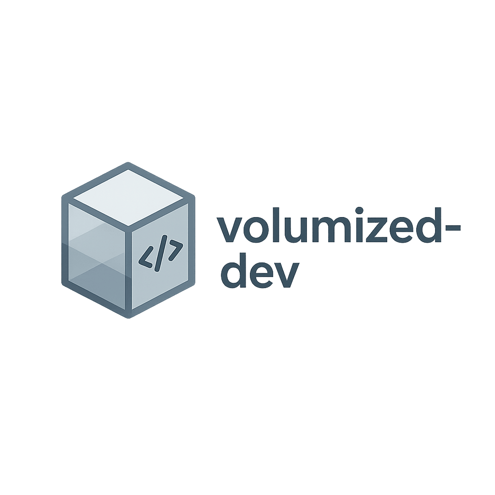

<!-- ========================================================= -->
<!--           volumized-dev | README Header Template          -->
<!-- ========================================================= -->

<p align="center">
  
  <br/><br/>
  
</p>

<h1 align="center">Volumized Dev Environment</h1>

<p align="center">
<em>A fully isolated, reproducible development environment for macOS (Apple Silicon) using <strong>VS Code</strong>, <strong>Docker</strong>, and <strong>OrbStack</strong> — keeping your host system clean while running all development inside a Docker **volume-based** container.<em>
</p>

<p align="center">
  <a href="https://github.com/jfheinrich-eu/volumized-dev"></a>
  <a href="https://github.com/jfheinrich-eu/volumized-dev/blob/main/LICENSE"></a>
  <a href="https://github.com/features/codespaces"></a>
</p>

- [🚀 Overview](#-overview)
- [🧰 Features](#-features)
- [⚙️ Requirements](#️-requirements)
- [🧩 Directory Structure](#-directory-structure)
- [🧭 Quick Start](#-quick-start)
- [📚 Documentation](#-documentation)
- [👥 Authors \& Credits](#-authors--credits)
- [🪪 License](#-license)

---

## 🚀 Overview

This project sets up a **self-contained VS Code development environment** with:

- Clean host — no local dependencies, no clutter  
- Full isolation via Docker **volumes** (not bind mounts)  
- Secure SSH and GPG integration for Git operations  
- Optimized for **OrbStack** (fast native Docker engine on macOS ARM)  
- Ready-to-go **VS Code integration** via the *Dev Containers* extension  

---

## 🧰 Features

- Reproducible development environments
- SSH and GPG keys injected automatically
- Support for Node.js, Python, or mixed-language stacks
- Optional host SSH agent forwarding
- Backup and restore via Docker volume archives
- Lightweight and fast (ARM64-native)

---

## ⚙️ Requirements

- macOS with Apple Silicon (M1/M2/M3)
- [OrbStack](https://orbstack.dev) (Docker backend)
- [Visual Studio Code](https://code.visualstudio.com/)
  - Extensions:
    - `ms-vscode-remote.remote-containers`
    - `ms-python.python`
    - `ms-azuretools.vscode-docker` (optional)
- Git + SSH access to your repositories

---

## 🧩 Directory Structure

```
volumized-dev/
├─ Dockerfile
├─ .env.example
├─ scripts/
│  ├─ build_image.sh
│  ├─ create_volume.sh
│  ├─ init_repo_in_volume.sh
│  ├─ put_secrets_into_volume.sh
│  ├─ run_container.sh
│  ├─ stop_remove_container.sh
│  ├─ shell_into_container.sh
│  ├─ volume_backup.sh
│  ├─ volume_restore.sh
│  └─ test_dev_env.sh
├─ initial_run.sh
├─ LICENSE
└─ docs/
   └─ UseVolumizedDevEnvironment.md
   └─ assets
      ├─ volumized-dev-logo.png
      └─ volumized-dev-banner.png
```

---

## 🧭 Quick Start

1. **Prepare environment variables**
   ```bash
   cp .env.example .env
   ```
   Edit `.env` to define:
   - SSH and GPG key paths
   - Git identity
   - Volume, container, and image names

2. **Run the setup script**
   ```bash
   chmod +x initial_run.sh
   ./initial_run.sh
   ```
   This will:
   - Build the dev image
   - Create or reuse your Docker volume
   - Copy SSH/GPG keys inside
   - Start the container
   - Install a self-test script

3. **Open in VS Code**
   - Command Palette → “Dev Containers: Attach to Running Container…”
   - Choose your container name
   - Open folder `/work`
   - Start coding!

4. **Run validation (inside container)**
   ```bash
   /work/.devcontainer/test_dev_env.sh
   ```

---

## 📚 Documentation

Detailed setup instructions, daily workflow, and backup/restore usage are available here:  
👉 [docs/UseVolumizedDevEnvironment.md](docs/UseVolumizedDevEnvironment.md)

---

## 👥 Authors & Credits

Created by **Jörg Heinrich <joerg@jfheinrich.eu>**  
Co-authored and documented with the assistance of **ChatGPT (OpenAI)**

---

## 🪪 License

This project is licensed under the [MIT License](LICENSE).
