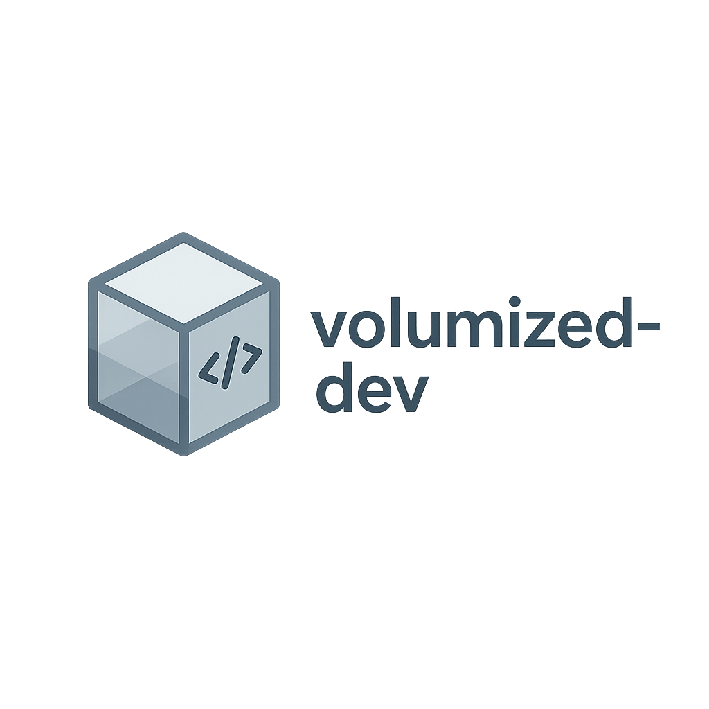

<p align="center">
  
</p>

# Volumized Dev Environment (VS Code + Docker + OrbStack)

**Purpose:**  
This environment provides a **fully isolated development workspace** on macOS (Apple Silicon), using **Docker volumes** instead of host-mounted folders.  
Your host stays clean — all source code, dependencies, and secrets (SSH/GPG) live **inside the container volume**.  
VS Code connects directly to the container using the **Dev Containers extension**.

---

## 🧭 Overview

The `volumized-dev` setup was designed to:

- Enable **clean, reproducible, and isolated** development environments.  
- Keep your **host filesystem untouched** (no node_modules, venvs, etc.).  
- Use **Docker volumes** instead of bind mounts for full separation.  
- Support **SSH & GPG integration** for secure Git operations.  
- Work seamlessly with **OrbStack** (fast, native Docker engine for macOS ARM).  
- Provide **VS Code integration** for editing, debugging, and terminals inside the container.

This makes it ideal for developers who want a **contained dev system** that can be rebuilt, backed up, and shared easily.

---

## ⚙️ Requirements

- macOS with Apple Silicon (M1/M2/M3)
- [OrbStack](https://orbstack.dev) installed and running
- [Visual Studio Code](https://code.visualstudio.com/)
  - Extensions:
    - `Dev Containers` (`ms-vscode-remote.remote-containers`)
    - Language/tool-specific extensions (Python, Node.js, Docker, etc.)
- Homebrew (for installing dependencies, if needed)
- GitHub or other Git remote (SSH recommended)

---

## 🚀 First-Time Setup

1. **Clone this repository:**
   ```bash
   git clone https://github.com/jfheinrich-eu/volumized-dev.git
   cd volumized-dev
   ```

2. **Prepare environment variables:**
   ```bash
   cp .env.example .env
   ```
   Edit `.env` with your preferences.

3. **Run the orchestration script:**
   ```bash
   chmod +x initial_run.sh
   ./initial_run.sh
   ```

4. **Connect from VS Code:**
   - Command Palette → “**Dev Containers: Attach to Running Container…**”
   - Choose your container name
   - Open folder `/work`

---

## 💻 Daily Workflow

1. **Start OrbStack** (if not already running).  
2. **Ensure container is running:**
   ```bash
   docker ps
   ```
3. **Attach VS Code:** open `/work`.  
4. **Develop as usual.**  
5. **Stop when done:**
   ```bash
   ./scripts/stop_remove_container.sh
   ```
6. **Back up your volume (optional):**
   ```bash
   ./scripts/volume_backup.sh
   ```

---

## 👥 Authors & Credits

Created by **Jörg Heinrich <joerg@jfheinrich.eu>**  
Co-authored and documented with the assistance of **ChatGPT (OpenAI)**

---

## 🪪 License (MIT)

MIT License

Copyright (c) 2025 Jörg Heinrich

Permission is hereby granted, free of charge, to any person obtaining a copy
of this software and associated documentation files (the "Software"), to deal
in the Software without restriction, including without limitation the rights
to use, copy, modify, merge, publish, distribute, sublicense, and/or sell
copies of the Software, and to permit persons to whom the Software is
furnished to do so, subject to the following conditions:

The above copyright notice and this permission notice shall be included in
all copies or substantial portions of the Software.

THE SOFTWARE IS PROVIDED "AS IS", WITHOUT WARRANTY OF ANY KIND, EXPRESS OR
IMPLIED, INCLUDING BUT NOT LIMITED TO THE WARRANTIES OF MERCHANTABILITY,
FITNESS FOR A PARTICULAR PURPOSE AND NONINFRINGEMENT. IN NO EVENT SHALL THE
AUTHORS OR COPYRIGHT HOLDERS BE LIABLE FOR ANY CLAIM, DAMAGES OR OTHER
LIABILITY, WHETHER IN AN ACTION OF CONTRACT, TORT OR OTHERWISE, ARISING FROM,
OUT OF OR IN CONNECTION WITH THE SOFTWARE OR THE USE OR OTHER DEALINGS IN
THE SOFTWARE.
